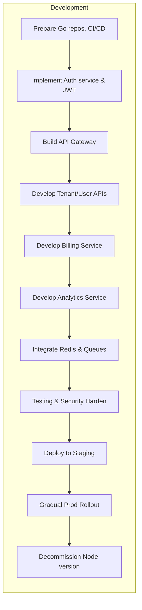

# Executive Summary  
The multi-tenant SaaS system will be re-implemented entirely in Go, with PostgreSQL as the database. All Node.js components (API Gateway, Authentication, Billing, Analytics, Tenant Management, etc.) are replaced by Go services.  We compare Go frameworks (e.g. Gin, Echo, Fiber) and ORMs (GORM, sqlx, pgx) to recommend the right tools.  Each service’s architecture, data model, and API will be defined (using OpenAPI).  Security (JWT auth in Go) and tenant isolation (Postgres pooled/schema/silo with RLS) are addressed.  We add Redis caching, async message queues, and Prometheus/Grafana for monitoring.  CI/CD is built with Docker, Kubernetes, Helm, and Terraform.  We identify risks (e.g. data leakage, performance hotspots) and mitigation (e.g. RLS, horizontal scaling).  Finally, we outline a step-by-step migration roadmap with tasks, effort estimates, and a staged rollout (staging, canary, blue/green).  Tables compare frameworks/ORMs/deployments, and Mermaid diagrams illustrate the new architecture and migration timeline.  

## Replacing Node.js Components  
The original Node.js microservices (Express-based gateway, auth service, billing service, usage/analytics service, tenant manager, etc.) must be re-developed in Go.  We inventory each component:  
- **API Gateway** – formerly a Node.js gateway (likely using Express or NestJS) is replaced by a Go framework (e.g. Gin or Echo) to handle routing and middleware.  
- **Authentication Service** – previously in Node (handling user signup/login, JWT issuance) will use Go with a JWT library.  
- **Billing Service** – a Node.js service (integrating Stripe or billing logic) becomes a Go service (using [stripe-go](https://github.com/stripe/stripe-go)).  
- **Usage/Analytics Service** – replaced by Go service to collect metrics or events.  
- **Tenant Management** – user/tenant CRUD, previously Node, now Go.  
- **Other Services** – any utility or auxiliary services (e.g. email notifications) also move to Go.  

For each, we will rebuild the code structure in Go.  Implementation details of the original Node code are unspecified, so we assume typical microservice patterns (REST endpoints, database access, middleware, etc.) and re-create them idiomatically in Go.  

## Go Web Frameworks, ORMs, and Libraries  
We evaluate popular Go web frameworks and database libraries:  

| **Web Framework** | **Performance**             | **Use Cases**                             | **Community & Docs**               |
|-------------------|-----------------------------|-------------------------------------------|------------------------------------|
| **Gin**           | High (excellent RPS, low mem)【35†L142-L150】 | APIs, microservices, lightweight apps     | Mature, >80k GitHub stars, extensive docs【35†L142-L150】 |
| **Fiber**         | Very High (superior RPS, low mem)【35†L142-L150】 | APIs, microservices, performance-critical web apps | Express.js-like syntax, easy migration, ~35k stars【35†L142-L150】 |
| **Echo**          | High (excellent RPS, low mem)【35†L142-L150】 | APIs, microservices, performance-sensitive apps | Minimalist, clean API, growing community (~30k stars)【35†L142-L150】 |
| **Chi**           | High (lightweight)          | APIs, modular routing                     | Composable router, good integration with `net/http` |
| **Fiber**         | (Included above)            |                                           |                                    |
| **Beego**         | Moderate (full-stack)       | Full-stack apps, ORMs included           | Mature, older framework with many features |
| **FastHTTP**      | Very High                   | Custom servers, raw HTTP performance     | Low-level, less abstraction (22k stars)【35†L156-L164】 |
| **Gorilla Mux**   | Moderate                    | General routing, websockets              | Well-used router, not full framework |
| **Hertz**         | Extremely High              | Microservices, high-throughput APIs      | Optimized (ByteDance) (6k stars)【35†L166-L168】 |

**Recommendation:** For our microservices, **Gin** or **Fiber** are excellent choices due to high throughput and ease of use.  Gin has a very large ecosystem and learning curve is moderate. Fiber offers Express-like syntax for fast adoption (especially if the team has Node.js background). Echo is also performant and minimalist. We will select one for consistency across services (for example, Gin for its rich middleware and documentation【35†L142-L150】).  

| **ORM/DB Library** | **Description**                            | **Pros/Cons**                                  |
|--------------------|--------------------------------------------|----------------------------------------------|
| **GORM**           | Full-featured ORM (auto-migrations, models)【37†L33-L42】 | + Easy rapid prototyping, multi-DB support; - Slower (uses reflection)【37†L54-L62】 |
| **sqlx**           | Extension of database/sql for SQL building【37†L44-L52】 | + Type-safe queries, driver-agnostic; - Moderate performance lag vs pgx【37†L44-L52】【37†L54-L62】 |
| **pgx**           | Native PostgreSQL driver/pool【37†L54-L62】 | + Fastest (Postgres-specific optimizations)【37†L54-L62】; - Only Postgres, more manual SQL |
| **sqlc**           | Code-generation from SQL (compile-time)    | + Type-safe, no runtime reflection; - Requires writing raw SQL |
| **Ent**            | Graph-based ORM by Facebook (schema codegen) | + Type-safe, migrations; - Learning curve |
| **Database/sql**   | Go std lib interface                       | + Universal, but low-level; need manual queries or builders |
| **Squirrel**       | SQL query builder                         | + Fluent API, works with database/sql        |

**Recommendation:** If we need rapid development and multi-DB (unlikely, since we standardize on Postgres), GORM is convenient. However, for performance-critical services, **pgx** is ideal【37†L54-L62】. We can use GORM or sqlx in less critical parts (e.g. Billing) for developer speed, and pgx (or sqlc with pgx driver) in high-load services (Usage analytics)【37†L54-L62】.  

A reference benchmark found pgx outperforms sqlx/GORM by ~30–50% in throughput【37†L54-L62】. GORM 2.0 has improved but still lags raw drivers.  We will likely mix GORM for convenience (it has auto-migrations) and pgx (direct `database/sql`) where needed for speed.  

## Service-by-Service Design in Go  
### API Gateway (Go)
- **Architecture:** A Go service (e.g. using Gin) that sits at the entry point. It handles request routing to downstream services, authentication middleware, rate limiting, and routing logic.  
- **Packages:** Use Gin/Echo for routing; `github.com/golang-jwt/jwt/v5` for JWT parsing; `github.com/go-redis/redis/v8` (go-redis) for caching or rate-limit counters; `github.com/gin-contrib/cors` for CORS; `github.com/sirupsen/logrus` or Uber’s `zap` for logging; `github.com/prometheus/client_golang/prometheus` for metrics.  
- **API Contracts:** Define OpenAPI/Swagger spec covering routes (e.g. `/login`, `/signup`, plus all proxied endpoints). Use a Swagger tool (e.g. [swaggo/swag](https://github.com/swaggo/swag)) to generate docs.   
- **Authentication:** Validate incoming JWTs in middleware. Preferred algorithm is RSA (RS256) with JWKS (WorkOS recommends RS256/JWKS for secure microservices【47†L139-L147】【47†L163-L170】). Verify signature and claims (`exp`, `iss`, `aud`). Deny requests failing auth. The gateway adds tenant context (from token) to HTTP headers or context before forwarding.  
- **Tenant Isolation:** The gateway doesn’t store data but must check tokens for a tenant ID claim. It then routes calls to tenant-specific endpoints or adds `X-Tenant-ID` header.  
- **Caching:** Use Redis for short-term caching of auth tokens or rate-limit counters. For static responses (if any), enable caching/CDN.  
- **Async Patterns:** Generally synchronous (gateway-to-service). Use goroutines carefully and context timeouts for calls.  
- **Observability:** Instrument metrics (request count, latency) with Prometheus and expose `/metrics`. Log in JSON with structured fields (GIN middleware with logger).  
- **Testing:** Unit-test handlers with Gin’s testing tools; integration tests by running gateway against dummy services or mocks.  
- **CI/CD:** Containerize (multi-stage Docker). Deploy on Kubernetes as part of helm charts (gateway service, ingress). Use liveness/readiness probes.  

### Authentication Service (Go)
- **Architecture:** A Go microservice (Gin/Echo) that manages users, passwords (hashed via `bcrypt`), and JWT issuance. Connects to Postgres (via GORM/sqlx/pgx).  
- **Packages:** `golang-jwt/jwt` for token creation/verification; `golang.org/x/crypto/bcrypt`; GORM or pgx for DB; `github.com/google/uuid` for IDs. Possibly `github.com/gin-contrib/sessions` if session support needed.  
- **Data Models:** Tables for `tenants` and `users`. E.g. Tenant({tenant_id UUID PK, name, status}), User({user_id, tenant_id FK, email, password_hash, roles}). Use Go structs annotated for the ORM. Enable Postgres RLS (see Tenant Isolation).  
- **API Contracts (Swagger):** Endpoints like `POST /signup`, `POST /login`, `GET /user/profile`, etc. Define request/response schemas.  
- **Authentication Flow:** On signup, create a Tenant record and the first User (or link to an existing tenant if known). Hash password. On login, verify credentials and issue JWT including `sub=user_id` and `tenant=tenant_id` claims. Use RS256 (private key on service, public key in gateway)【47†L139-L147】.  
- **Tenant Isolation:** Set `tenant_id` on all queries. Implement Postgres RLS: for each table, define policy `USING (tenant_id = current_user)` where `current_user` is set to tenant ID (as string) on connection【40†L107-L113】. For example, do `SET ROLE '<tenant_id>';` after authenticating. Or use a parameter in each query’s WHERE clause, enforced via RLS policies on tables【40†L107-L113】.  
- **Caching:** Possibly cache password reset tokens in Redis with expiration. Could also cache recent login attempts or user sessions.  
- **Async:** Send welcome emails or notifications by enqueuing messages. E.g. push a message to NATS/Kafka when a user is created, consumed by an Email service. Use libraries like [nats-io/nats.go](https://github.com/nats-io/nats.go) or [segmentio/kafka-go].  
- **Observability:** Track metrics (e.g. login attempts, sign-ups) with Prometheus. Log events (logrus/zap).  
- **Testing:** Unit tests for hashing/verification logic; integration tests against a test Postgres (in Docker).  
- **CI/CD:** Build a Docker image. Use Kubernetes deployment; ensure secrets (JWT keys) via Kubernetes Secrets or Vault.  

### Billing Service (Go)  
- **Architecture:** Handles subscription plans and payments. It will integrate with Stripe using [stripe-go](https://github.com/stripe/stripe-go).  
- **Packages:** `github.com/stripe/stripe-go/v72` for Stripe API; ORM for storing plans/subscriptions; `gin` for HTTP server; email package if needed.  
- **Data Models:** Tables for `plans`, `subscriptions`, `invoices`. Each record includes `tenant_id`. For example, Subscription({id, tenant_id, stripe_customer_id, plan_id, status, start_date}).  
- **API Contracts:** Endpoints for creating/updating plans, subscribing a tenant to a plan, webhook endpoint (`POST /stripe-webhook`) to receive events (charge succeeded/failed). Swagger docs specify expected JSON fields.  
- **Authentication:** Protect API endpoints with JWT (validate in middleware) to ensure only authorized internal calls can modify billing data.  
- **Tenant Isolation:** Filter all queries by `tenant_id`. Can optionally use RLS on billing tables, so each tenant’s billing data is isolated.  
- **Caching:** Unlikely needed except maybe cache plan details.  
- **Async:** Stripe webhooks are asynchronous by nature. We’ll parse webhook events and update DB. Could use a message queue if we want to decouple: e.g. webhook -> NATS -> billing worker.  
- **Observability:** Metrics on number of subscriptions, payment failures. Log all Stripe events.  
- **Testing:** Unit-test logic around Stripe integration (using Stripe test keys). Integration tests could mock Stripe’s API.  
- **CI/CD:** Docker/Helm as usual.  

### Usage/Analytics Service (Go)  
- **Architecture:** Collects and queries usage metrics/events. Could use a time-series DB or BigQuery, but for simplicity use PostgreSQL or InfluxDB.  
- **Packages:** If using Postgres, pgx/sqlx. Gin for API. For event publishing, use [NATS Go client](https://pkg.go.dev/github.com/nats-io/nats.go) or similar. For metrics, `promhttp`.  
- **Data Models:** If storing events: Event({id, tenant_id, event_type, payload JSONB, timestamp}). Or use tables for counters, aggregated stats.  
- **API Contracts:** `POST /events` to record usage (bulk or single). `GET /metrics` to retrieve aggregated stats. Swagger docs define event schema.  
- **Authentication:** JWT middleware to ensure only client services (or clients) can post events.  
- **Tenant Isolation:** Tag each event with `tenant_id`. Use RLS on the events table if needed. The service only returns data for the requesting tenant.  
- **Caching:** Can use Redis to store pre-aggregated counters or recent results for quick reads.  
- **Async:** Likely the service itself runs asynchronously: e.g. publish incoming events to a Kafka/NATS topic, and a worker reads and writes to the DB. This decoupling handles spikes. Use [segmentio/kafka-go] or NATS.  
- **Observability:** Prometheus metrics for events processed per second, queue depth. Log slow requests.  
- **Testing:** Mock NATS/Kafka for testing message handling; unit-test aggregation logic.  
- **CI/CD:** Deploy similarly.  

### Tenant Management Service (Go)  
- **Architecture:** Manages tenant lifecycle (create/update tenant profile, suspend/reactivate tenant). Could be merged with Auth, but as a separate service keeps concerns clear.  
- **Packages:** Gin/Echo, GORM/sqlx/pgx, uuid library, validation (e.g. `go-playground/validator`).  
- **Data Models:** Tenant({tenant_id UUID PK, name, plan_id, status, metadata JSONB}). Relations: many users, one plan.  
- **API Contracts:** `POST /tenant` (new tenant), `GET /tenant/{id}`, `PUT /tenant/{id}`, etc. Swagger-defined.  
- **Authentication:** Only internal admin tokens or owners can call these. Use strict JWT claim checks.  
- **Tenant Isolation:** Not applicable for tenant creation (global action). But once created, the tenant’s own data is partitioned.  
- **Caching:** Cache tenant configuration (e.g. plan features) in Redis for quick access.  
- **Async:** Enqueue provisioning tasks (e.g. provision resources) to a message queue if needed.  
- **Observability:** Log tenant creation events; count active tenants in Prometheus.  
- **Testing:** Validate RBAC (tenant admins vs global admins) in tests; mock DB.  
- **CI/CD:** Same pipeline.  

## Data Models and Tenant Isolation (PostgreSQL)  
Each service’s data tables include a `tenant_id` column. We will use PostgreSQL’s **Row-Level Security (RLS)** to enforce isolation at the database layer【40†L107-L113】. For a “pooled” model (shared tables), define a policy on each table, e.g.:  
```sql
ALTER TABLE users ENABLE ROW LEVEL SECURITY;
CREATE POLICY tenant_policy ON users
  USING (tenant_id::text = current_setting('app.tenant_id'));
```  
In Go, after authenticating a request, set the session parameter: `db.Exec("SET app.tenant_id = ?", tenantID)` so that `current_setting('app.tenant_id')` equals the tenant’s ID. This way every query automatically filters to the tenant’s rows【40†L107-L113】. For schemas (`bridge` model), each tenant could have its own schema (e.g. `tenant123.users`); in that case, the service would select from the proper schema. The “silo” model (one DB per tenant) offers maximum isolation but higher cost【40†L75-L84】. We can start with pooled+RLS for cost efficiency, and later migrate high-value tenants to separate schemas or DBs if needed.  

Data migrations will use Go migration tools (e.g. [golang-migrate](https://github.com/golang-migrate/migrate)). Define versioned SQL or use GORM’s auto-migration for simple cases. Ensure migrations add `tenant_id` columns and RLS policies as needed.  

## Authentication (JWT) in Go  
We will use **RS256** (RSA with SHA256) for JWTs, as it’s recommended for distributed systems【47†L139-L147】. The Auth service will sign tokens with its RSA private key; the API gateway will verify using the public key. We can publish a JWKS endpoint or store the public key in the gateway. The [WorkOS guide](https://workos.com/blog/how-to-handle-jwt-in-go) recommends using asymmetric keys and rotating via JWKS【47†L139-L147】【47†L163-L170】. Include standard claims (`exp`, `iat`, `iss`, `aud`), and custom claims for `sub=userID`, `tenant=tenantID`, and user roles. Use `github.com/golang-jwt/jwt/v5` library (the community fork of jwt-go) for token handling【47†L123-L132】. Always verify the signature and the token hasn’t expired. Store refresh tokens in Redis or use a rotating refresh token strategy to enhance security.  

## Caching and Message Queues  
**Caching:** Use [go-redis](https://pkg.go.dev/github.com/redis/go-redis) (official Redis client for Go) for caching. Common uses: rate-limiting counters in the gateway, caching user sessions or JWT blacklists, and caching frequent read queries (e.g. plan details). Example: cache JWT revocation lists or password reset tokens with TTL. Use namespaced keys per tenant (e.g. `tenant:123:jwt_blacklist`).  

**Async Messaging:** For background or decoupled tasks, use a message broker. Popular choices: RabbitMQ (`github.com/streadway/amqp`), NATS (`github.com/nats-io/nats.go`), or Kafka (`github.com/segmentio/kafka-go`). For example, on user signup, the Auth service could publish a `tenant.created` event; an Email service subscribes and sends a welcome email. For usage events, services could publish to a “usage” topic for the Analytics service to process. As an example, NATS is lightweight and works well with Go. These systems handle high throughput and decouple services.  

## Observability and Logging  
- **Metrics:** Use [Prometheus Go client](https://github.com/prometheus/client_golang) to expose application metrics. For example, register HTTP request counters and histograms for latency. Each service exposes a `/metrics` endpoint. Use Grafana for dashboards.  
- **Logging:** Employ structured logging (JSON). Libraries like [logrus](https://github.com/sirupsen/logrus) or [zap](https://github.com/uber-go/zap) are widely used. Include fields like timestamp, service name, level, tenant ID, user ID, request ID. This enables filtering logs per tenant.  
- **Tracing (optional):** Consider OpenTelemetry for distributed tracing (jaeger). Use `go.opentelemetry.io/otel` to instrument HTTP handlers and database calls.  

## Testing Strategies  
Follow a **testing pyramid**:  
- **Unit tests:** Write Go `*_test.go` files for functions/methods. Use Go’s `testing` package, with `gomock` or `testify` for mocks/assertions【45†L90-L99】. Keep business logic in pure functions (no side effects) to simplify testing.  
- **Integration tests:** Use a Dockerized Postgres and Redis to run integration tests. Tools like [gnomock](https://github.com/orlangure/gnomock) can spin up DBs for tests. Test end-to-end flows (e.g. signup → get JWT).  
- **End-to-end tests:** In staging, run full system tests (e.g. using [go-hit](https://github.com/Eun/go-hit) or Postman collections) to simulate client behavior. Focus on critical paths (login, signup, payment).  
- **Benchmarking:** Use Go’s `testing.B` to benchmark critical functions (e.g. DB queries).  

## CI/CD and Deployment  
- **Docker:** Write a Dockerfile per service (use multi-stage build: build Go binary, then minimal image). Ensure static compilation (`CGO_ENABLED=0`).  
- **Kubernetes:** Deploy each service as a Kubernetes Deployment + Service. Use an Ingress (or API Gateway like Kong) for external access.  
- **Helm:** Package each microservice as a Helm chart or use a Helm umbrella chart. Encapsulate Kubernetes resources (Deployments, Services, ConfigMaps, Secrets) and manage versioned releases.  
- **Terraform:** Manage infrastructure (Kubernetes cluster, managed PostgreSQL, managed Redis) with Terraform. For example, provision an AWS EKS cluster, RDS Postgres with subnet groups, etc. This ensures reproducible environment setup.  
- **Deployment Strategy:** Use **Blue-Green** or **Canary** deployments to reduce risk. For example, deploy new version alongside old, then switch traffic in the ingress. Tools like Argo Rollouts or flagging can help.  
- **Environments:** Maintain separate Dev, Staging, and Production. Use Git branches or tags to deploy to each. Run integration tests in staging before promoting to production.  

## Risks and Bottlenecks  
- **Tenant Data Leakage:** If RLS or query filters are misconfigured, one tenant could see another’s data. Mitigation: enforce RLS policies in DB (centralized)【40†L107-L113】 and include `tenant_id` in primary keys. Write automated tests for RLS coverage.  
- **JWT Security:** Using symmetric keys (HS256) risks key sharing. We use RS256 with JWKS rotating keys【47†L163-L170】. Ensure tokens expire reasonably and implement refresh token rotation to prevent token replay attacks.  
- **Performance Hotspots:** The database can be a bottleneck. Mitigation: add read-replicas, or split large tenants to separate schemas. Use connection pooling (`pgxpool`) and optimize queries. The choice of library matters: use pgx for high-throughput queries【37†L54-L62】.  
- **API Gateway Load:** The gateway can become a single point of failure. Scale it horizontally and put it behind a load balancer. Cache frequent responses (e.g. JWKS) to reduce load.  
- **Complexity:** More services mean more moving parts. Mitigation: strong monitoring/alerting, logging, and following the microservices pattern of one repo per service【22†L119-L121】. Use DevOps practices to manage complexity.  
- **Migration Errors:** During cutover from Node to Go, there’s risk of downtime or bugs. Use shadow testing (run both in parallel) and database replication to switch gradually.  

## Migration Roadmap  
1. **Preparation (1–2 weeks):** Set up repositories for Go services. Define the tech stack (decide Gin vs Echo, select ORM). Provision development infrastructure (minikube or a dev cluster) via Terraform. Write Terraform modules for cluster, Postgres, Redis.  
2. **Core Setup (2–3 weeks):** Implement foundational libraries and CI/CD: Dockerfiles, base Helm charts, common middleware for logging/JWT. Configure Prometheus/Grafana. Establish JWT key management (generate RSA keys, store in K8s secrets).  
3. **Auth & Gateway (2–4 weeks):** Develop the Authentication service and JWT flow. Create the API Gateway with routing and middleware. Test end-to-end authentication. Use a shared secret (RS256) to ensure interoperability. This is critical, so allocate more time.  
4. **Tenant & User APIs (2–3 weeks):** Build the Tenant Management and User (Auth) APIs. Create DB schemas with RLS. Migrate sample data from Node DB if any. Write and run migrations.  
5. **Billing & Payments (2–3 weeks):** Implement Billing service with Stripe integration. Set up Stripe test keys, webhooks. Migrate plan data. Ensure subscriptions properly update Postgres.  
6. **Analytics & Usage (3–4 weeks):** Build the Usage service to collect events. Set up message broker (NATS/Kafka). Integrate with Auth service to tag events. Perform load testing to size components.  
7. **Caching & Message Queues (1–2 weeks):** Integrate Redis caching (e.g. session store). Set up RabbitMQ/NATS cluster. Refactor services to use queues for async tasks.  
8. **Security Hardening & Testing (2–3 weeks):** Conduct security review (ensure RLS policies, JWT configs). Perform penetration tests. Complete unit/integration tests. Fix issues.  
9. **Staging Deployment (1–2 weeks):** Deploy all services to a staging cluster. Run full regression tests. Have a rollback plan.  
10. **Production Rollout (1–2 weeks):** Do a Blue-Green deployment. First route a small percentage of traffic (canary) to Go services while Node services still run. Monitor for errors. Once validated, switch fully. Keep Node environment on standby for rollback.  
11. **Post-Migration (ongoing):** Monitor performance, optimize queries, and scale as needed. Implement any remaining features.  



**Tables:** Detailed comparisons are shown above. For completeness, below is a summary table of deployment options:

| **Deployment Option** | **Description**                                      | **Pros**                                   | **Cons**                             |
|-----------------------|------------------------------------------------------|--------------------------------------------|--------------------------------------|
| **Docker Compose (Dev)** | Run all services locally in containers.           | Simple, minimal infrastructure; fast dev iteration. | Not scalable, not HA.                |
| **Kubernetes (Prod)** | Container orchestration (AWS EKS/GKE/AKS).           | Auto-scaling, self-healing, rolling updates (canary/blue-green)【22†L119-L121】. | Operational complexity, learning curve. |
| **Helm Charts**       | Package K8s apps for versioned deploys.              | Templatized configs, easy upgrades.        | Additional tooling overhead.         |
| **Terraform**         | Infra-as-Code for cloud resources (cluster, DB, etc).| Reproducible infra, multi-cloud support.   | Requires expertise, state management. |
| **Managed K8s (e.g. AWS EKS)** | Cloud-managed Kubernetes service.            | Reduces ops (no master management).        | Vendor lock-in, costs.               |
| **Serverless (e.g. AWS Lambda)** | (Alternative) Functions instead of containers. | Automatic scaling, pay-per-use.            | Cold starts (though Go cold starts are small), limited execution time. |

## Conclusion  
The migration to Go and PostgreSQL modernizes the stack for performance and type safety. By choosing appropriate Go frameworks (e.g. Gin) and ORMs (GORM/pgx), and enforcing multi-tenant isolation via Postgres RLS【40†L107-L113】, we maintain security and efficiency. JWT best practices (RS256 + JWKS【47†L163-L170】) and structured logging/metrics ensure observability. Tables above help select the best tools, and the migration plan minimizes downtime. This end-to-end guide provides the technical roadmap for developers to re-engineer the system in Go and deploy it reliably.  

**Sources:** Official documentation and experts were consulted, including microservice architecture patterns【22†L105-L113】, AWS SaaS best practices【40†L75-L84】【40†L107-L113】, Go library benchmarks【37†L54-L62】, and WorkOS/JWT security guides【47†L139-L147】【47†L163-L170】. These informed our design decisions and comparisons.